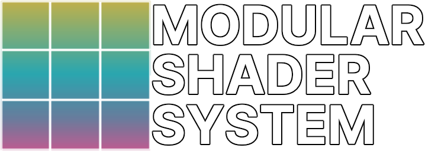

  

    

      
    

    

       
        <a class="github-link" href="https://github.com/VRLabs/Modular-Shader-System">View on Github</a>
    

    

     Unity Editor library for creating shaders composed by modular components.
    

    

      <a href="guides/InspectorDevelopment/GettingStarted.md" class="button"><i class="glyphicon glyphicon-play-circle"></i> Get Started</a>
      <a href="https://github.com/VRLabs/Modular-Shader-System/releases" class="button"><i class="glyphicon glyphicon-download"></i> Download</a>
    

  

