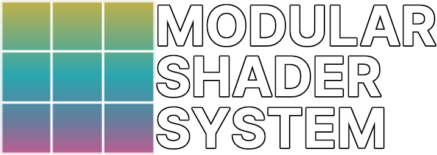

  
  <h1>Modular Shader System</h1>
  

     <i>Can i add a module in there?</i>
  

  
  
   
  
  
  
  
   
   

## What it is
The Modular Shader System is a system that let you create shaders from modular components.
This can let people add or remove modules to shaders made using this system, allowing to have easy third party integrations to a shader.

The system is aimed mainly to VRChat shaders, since that's the main environment where third party integrations to a shader make the most sense, but it is a standalone system that can be used anywhere.

For more informations on how to use it, check the official [Documentation](https://mss.vrlabs.dev).

## License

The modular Shader System is available as-is under MIT. For more information see [LICENSE](https://github.com/VRLabs/Modular-Shader-System/blob/master/LICENSE).

## Download

You can find the latest release in [Releases](https://github.com/VRLabs/Modular-Shader-System/releases/latest).

## Contributors

You want to help improve the library or fixing existing bugs? Feel free to contribute by sending a pr! We are always looking for improvements!

Made with [contributors-img](https://contributors-img.web.app).

## Showcase

These Shaders are made using the Modular Shader System, check them out!

* [Toony Standard RE:Build](https://github.com/VRLabs/Toony-Standard-Rebuild) by [@VRLabs](https://github.vrlabs.dev), our in house modular toon shader.
* [Poiyomi Toon Shader](https://github.com/poiyomi/PoiyomiToonShader) by [@Poiyomi](https://github.com/poiyomi), the most famous VRChat shader, reworked using the Modular Shader System with the advent of V8.0.

Made an awesome shader using the Modular Shader System and want to show it off? Join our [Discord](https://discord.vrlabs.dev) and show it to us! If we like it we may add it to this list!
